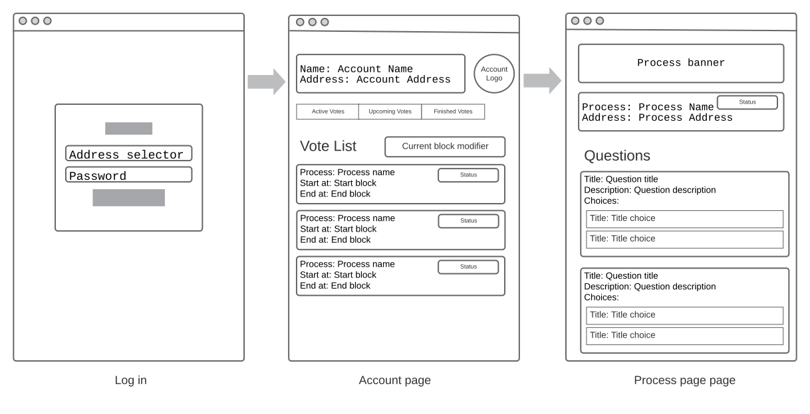

# Front end react challenge

This project was bootstrapped with [Create React App](https://github.com/facebook/create-react-app).

Feel free to add many dependencies as you need (styling, routing, testing ...) and use any style framework

## Data

All the required data is on /src/mock-data

### accounts.ts

List of accounts with the required data

### processes.ts

List of all the current processes

## Views

These project has 3 main views

### Login page

These page contains a form with to allow the user access to the restricted pages:
 - select with list of accounts 
 - Password input

These is the main page for all non logged users, if the user reload the page is not necessary maintain the session 

### Account page

These page is restricted for only logged accounts.

Process status:
  - Active: start block < current block < end block
  - Upcoming: current block < start block
  - Finished: end block < current block 

The user can see the account data and the list of processes, the user can do the following actions:
 - Show own process list filtered by the status, the user can change the filter status clicking on the buttons. The list must be updated.
 - Change the current block with input, the status of the processes must be updated.
 - When the user click on process, these redirect to the process detail page

### Process detail page

On these view the user can see all the process data, the options with the possibles responses